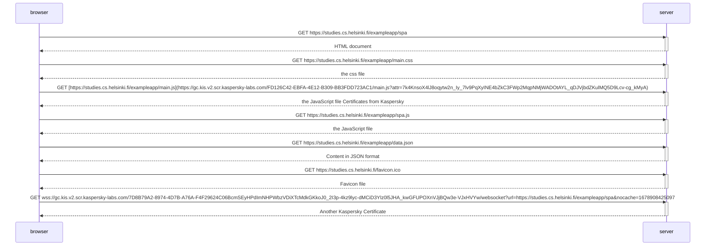

```mermaid
sequenceDiagram
    participant browser
    participant server

    browser->>server: GET https://studies.cs.helsinki.fi/exampleapp/spa
    activate server
    server-->>browser: HTML document
    deactivate server

    browser->>server: GET https://studies.cs.helsinki.fi/exampleapp/main.css
    activate server
    server-->>browser: the css file
    deactivate server

    browser->>server: GET [https://studies.cs.helsinki.fi/exampleapp/main.js](https://gc.kis.v2.scr.kaspersky-labs.com/FD126C42-EBFA-4E12-B309-BB3FDD723AC1/main.js?attr=7k4KnsoX4lJ8oqytw2n_Iy_7lv9PqXyINE4bZkC3FWp2MqpNMjWADOtAYL_qDJVjbdZKulMQ5D9Lcv-cg_kMyA)
    activate server
    server-->>browser: the JavaScript file Certificates from Kaspersky
    deactivate server
    
    browser->>server: GET https://studies.cs.helsinki.fi/exampleapp/spa.js
    activate server
    server-->>browser: the JavaScript file
    deactivate server


    browser->>server: GET https://studies.cs.helsinki.fi/exampleapp/data.json
    activate server
    server-->>browser: Content in JSON format
    deactivate server

    browser->>server: GET https://studies.cs.helsinki.fi/favicon.ico
    activate server
    server-->>browser: Favicon file
    deactivate server


    browser->>server: GET wss://gc.kis.v2.scr.kaspersky-labs.com/7D8B79A2-8974-4D7B-A76A-F4F29624C06BcmSEyHPdImNHPWbzVDiXTcMdkGKkoJ0_2I3p-4kz9lyc-dMCiD3Ylz0l5JHA_kwGFUPOXnVJjBQw3e-VJxHVYw/websocket?url=https://studies.cs.helsinki.fi/exampleapp/spa&nocache=1678908425097
    activate server
    server-->>browser: Another Kaspersky Certificate
    deactivate server
```
